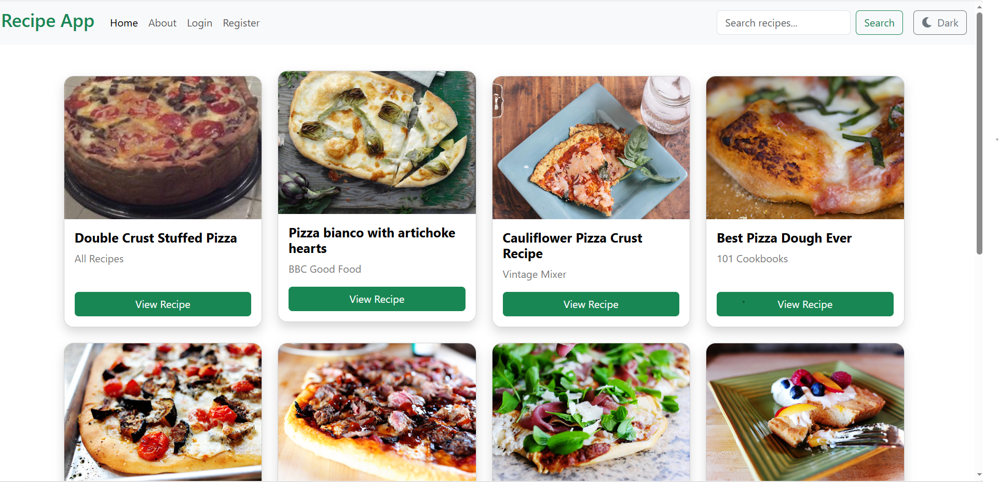
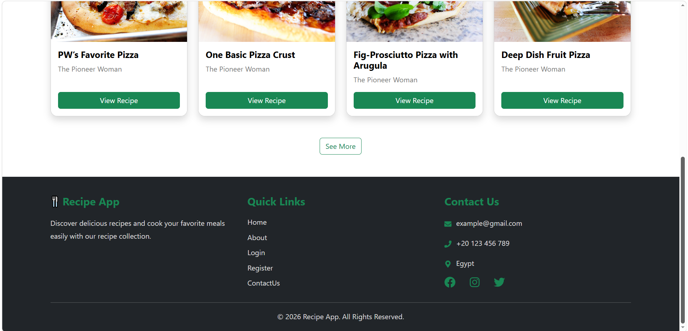
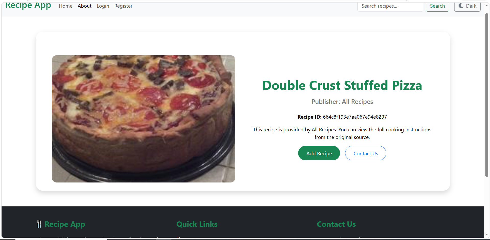
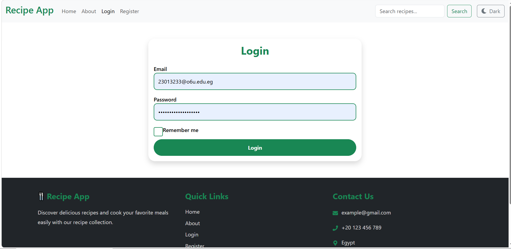
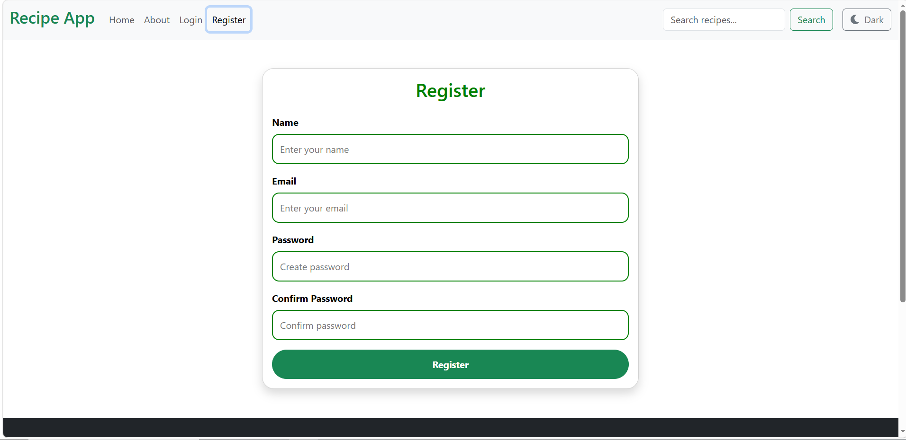
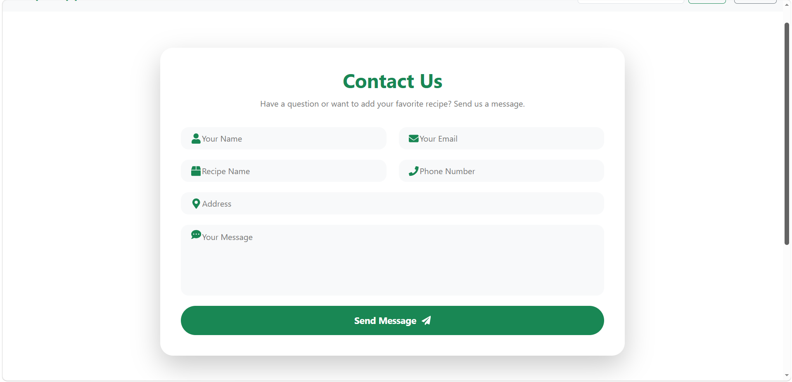
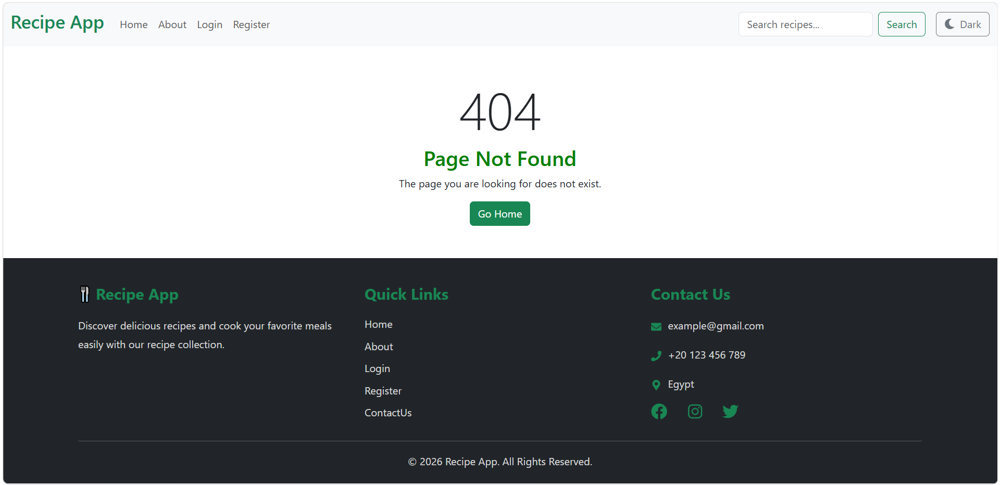

#  Recipe App

A modern and responsive Recipe Application built with React.

##  Features

- Search recipes using Forkify API
- Display recipes as cards
- View recipe details
- Register and Login using Local Storage
- Contact Us page
- Dark Mode
- Loading spinner
- Responsive design

##  Technologies

- React JS
- React Router DOM
- Axios
- Bootstrap
- CSS Modules
- React Icons
- Local Storage
- Forkify API

##  Screenshots

### Home Page



### Home + Footer



### Recipe Details



### Login



### Register



### Contact



### Not Found



##  Project Structure

```text
Recipe-App/
│
├── ScreenShot/
│   ├── home.png
│   ├── home+footer.png
│   ├── about.png
│   ├── login.png
│   ├── register.png
│   ├── contact.png
│   └── notfound.png
│
├── src/
│   │
│   ├── Components/
│   │   ├── About/
│   │   ├── Contact/
│   │   ├── Error/
│   │   ├── Footer/
│   │   ├── Home/
│   │   ├── Login/
│   │   ├── Navbar/
│   │   └── Register/
│   │
│   ├── assets/
│   │
│   ├── App.jsx
│   ├── main.jsx
│   └── index.css
│
├── public/
│
├── package.json
├── package-lock.json
├── vite.config.js
└── README.md

##  Author

**Doaa Hesham**

GitHub: https://github.com/doaa-hesham-ahmed

LinkedIn: https://www.linkedin.com/in/doaa-hesham-448459320/

